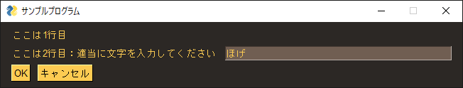

#  PySimpleGui を使ってみる

## インストール

```
pip install pysimplegui
```


## 使ってみた



OKを押下

```
c:\work\306_python\gui>python gui.py
あなたが入力した値：  ほげ
```


## 参考

[Qiita : Pythonでも簡単にGUIは作れる](https://qiita.com/konitech913/items/61dc715ddaad54505a29) 